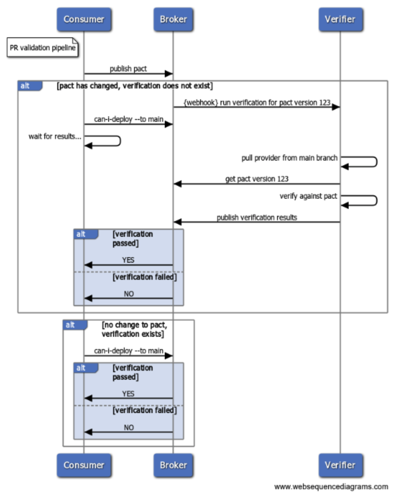

Before we merge a PR, it would be good to know if this change is compatible with the consumers and/or providers the application talks to.

We can answer this question using the can-i-deploy feature of Pact.

Ultimately, we will want to ask if you can deploy to a particular environment. But a good first step in that direction is to just make sure your change is compatible with what your consumers and providers have currently checked into their main branch.

This is a great step, but it's not fully what we want. It's quite possible that the pact version used by the application checked into the main branch is not the same as the pact version running in production or even staging.  The more frequently you deploy, and the faster you deploy, the less likely this is, but it's definitely a possibility.

This is much more the case for native apps, where you will likely have many old pact versions running on user's mobile devices. Any providers those apps talk to need to be compatible with all those versions.

In these cases, checking to see if your provider is compatible with the consumer version checked into main is not sufficient. We'll talk about how to check against what is actually deployed in a particular environment in the next section.

### Add can-i-deploy to consumer PR pipeline

  
Platinum diagram

This step is a bit tricky.

In your consumer PR pipeline, can-i-deploy with the tag of main will check to see if this consumer has been 
verified against the provider that is currently in the provider's main branch.

But if your consumer just generated and published a new version of the pact, this will always fail because the 
provider could not possibly have run verification against a newly changed pact.

You avoid this situation by registering a webhook in the Pact Broker that is triggered by the publication of a 
new pact. This webhook calls a job that runs provider verification for the new Pact.

So to get can-i-deploy working in your consumer PR pipeline, you need to follow these steps:

- Create a separate provider verification job that will be called by a webhook. This job takes the URL of the changed pact as a parameter.
- Add the webhook in the broker to call this job
- Add the can-i-deploy build step to the consumer PR validation build job

### Add a new provider verification job
This job runs provider verification, taking as a parameter the URL of the changed pact.  You set this up to be 
called through an API call, however your particular CI/CD system supports that.

1. Create a new CI job that performs just the provider pact verification step for a given pact URL. Consult the documentation for your chosen language for the syntax of how to configure this - you can find an example [here](/provider/recommended_configuration#verification-triggered-by-pact-change). The job should accept the URL of the changed pact in the HTTP request parameters or body. You can find a library of webhooks that trigger a build in many popular CI systems [here](/pact_broker/webhooks/template_library/), otherwise you'll need to consult the documentation for your CI application to learn how to pass in parameters to a build. Note that this build will fail when a consumer pushes an unsupported change to a contract - that is expected and fine. There should be no downstream dependencies on this build. Its only job is to run the verification for the changed pact and report the results back to the broker. 

### Add can-i-deploy webhook to Pact Broker
Once you have the provider verification job set up and working, you can integrate it with the Pact Broker by creating a webhook.

1. Configure a [webhook](/pact_broker/webhooks) to kick off the provider verification build when a pact changes, and use [webhook templates](/pact_broker/webhooks/dynamic_variable_sub) to pass the URL of the changed pact to the build.

After setting up the webhook, add `can-i-deploy` to your consumer job

Note:- If you can't use webhooks to trigger a build for technical or policy reasons, see below for a "webhookless" workflow.

Useful links:

* [Installing a Docker Pact Broker](https://hub.docker.com/r/pactfoundation/pact-broker)
* [Publishing verification results](/pact_broker/advanced_topics/provider_verification_results)
* [Configuring webhooks in the Pact Broker](/pact_broker/webhooks)
* [Adding verification badges to your READMEs](/pact_broker/advanced_topics/provider_verification_badges)
* [Versioning in the Pact Broker](/getting_started/versioning_in_the_pact_broker)

## Alternative "webhookless" workflow

If you can't use webhooks because of networking issues, then you can see an example of an alternative consumer pipeline design in this [example repository](https://github.com/pactflow/example-consumer-webhookless).

## Congrats

You now have a workflow where:

* A pact is published with every consumer build
* The latest version of that pact is verified with every provider build
* The verification results are published back to the broker
* Any change to the pact triggers a provider pact verification build.

## Next steps- Allow contracts to change without breaking the builds

One of the complications introduced by the "consumer driven" nature of the workflow is that new interactions are usually added to the contract before the functionality has been implemented in the provider. Using the workflow described above, a provider build will be kicked off when you publish a contract with new interactions in it. This build will \(correctly\) fail during the verification task. This is not ideal, as the failure is expected. To solve this, we need to allow contracts to change without breaking the builds.
