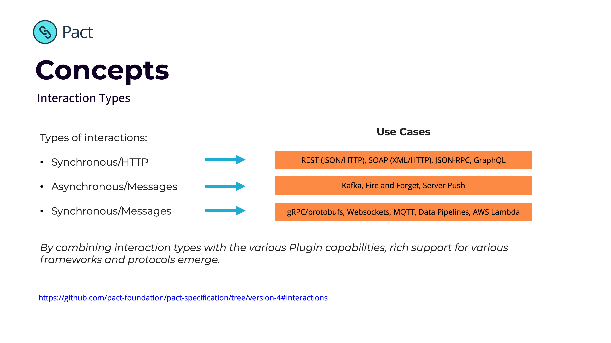
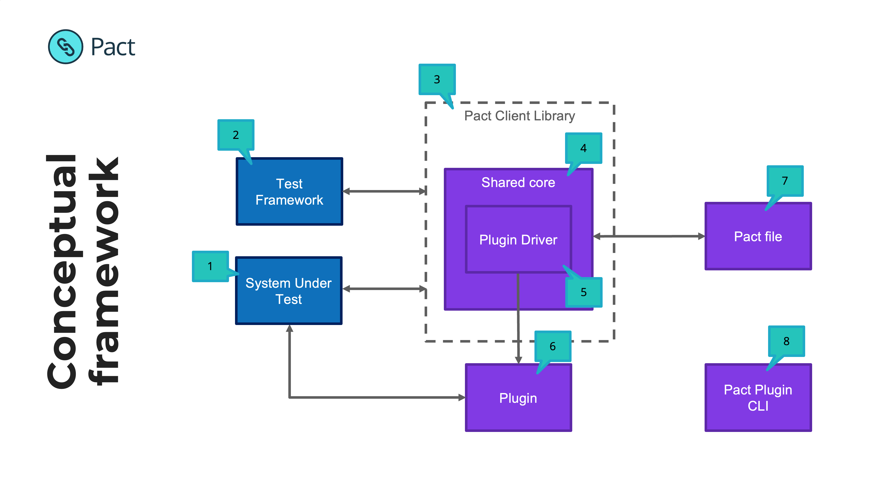

# Getting started with Pact Plugins

## Introduction to Plugins

**Goals**

The Pact Plugin Framework was created in order to:

* Expand support to the widest range of use cases
* Improve time-to-market for new features
* Grow our community (users + contributors)

The framework allows users to extend Pact by creating new types of:

* Transports (e.g. gRPC, Websockets)
* Protocols (e.g. protobufs, GraphQL)

**Interaction types**

Pact has three types of interactions:

1. Synchronous/HTTP - models standard HTTP interactions
2. Asynchronous/Messages - models unidirectional events/messages
3. Synchronous/Messages - models bi-directional or streaming events/messages

The combination of these interaction types with new transports and protocols, enables you to model almost any type of API and support any use case.

## Conceptual Overview

Diving a bit deeper, let's look at the various system actors and how they work together with Plugins.

1. Your code 😉
2. The test framework executing tests e.g. Jest, JUnit
3. The Pact Client library used in the test e.g. Pact JS, Pact JVM
4. The Shared Core (Rust) or the Java Plugin Driver (for JVM projects) manages the lifecycle of a Pact test and provides key capabilities to client libraries. It oversees the use of plugins via the Plugin Driver

5. Plugin driver is responsible for discovering, starting and orchestrating plugins.
6. Plugin may communicate to/from the SUT e.g. in the case of a new transport it will serve as the mock server, and will also issue verification requests at the Provider API
7. The pact file contains additional information
   * Required plugins
   * Transports
   * Interaction type
   * Markdown to display interactions

## How do I get started?

- Try out a pre-made plugin
  - Download the [Pact CLI tool](/plugins/directory#plugin-tooling) for managing plugins
  - Visit the [Pact Plugin Directory](/plugins/directory) and check if one already exists
  - Check out our [demo applications](/plugins/directory#demos) that you can clone and run on your machine.
- Build your own plugin for any use case you and your team require.
  - Check out our Pact University [workshop](/plugins/workshops/create-a-plugin/intro), where you will create and publish your first distributable Pact Plugin.
    - You can [run it in your browser](https://killercoda.com/pactflow/scenario/create-a-plugin) too!
  - Check out some of the [early protoype plugins](/plugins/directory#plugin-prototypes).
  - Grab one of our [Pact Plugin Starter kits](/plugins/directory#template-plugins)
  - Check out the docs for authors
    - Writing a plugin [guide](https://docs.pact.io/implementation_guides/pact_plugins/docs/writing-plugin-guide)
    - Plugins that provide protocol transport implementations - See [Protocol design docs](https://docs.pact.io/implementation_guides/pact_plugins/docs/protocol-plugin-design).
    - Plugins that provide support for different types of content - See [Content matcher design docs](https://docs.pact.io/implementation_guides/pact_plugins/docs/content-matcher-design).
    - Matching Rules - See the [matcher definition expressions](http://localhost:3000/implementation_guides/pact_plugins/docs/matching-rule-definition-expressions)
- [Vote for a plugin, or add your own request](https://pact.canny.io/)
- Exited and want to talk about it?
  - [Discuss on Slack](http://slack.pact.io/)
  - Community Resources
  - Community Demos
- Find out how you can [Contribute](https://docs.pact.io/contributing) more generally
- Stuck? Ask for [help](https://docs.pact.io/help)

## FAQ

### Why did we build the Pact Plugin Framework?

Loved by thousands of development teams globally, Pact was originally created to support the rise of RESTful microservices and has since expanded to support asynchronous messaging, becoming the defacto API contract testing solution.

As architectures have evolved, organisations find that the existing Pact contract testing framework may not support all of their use cases.

The industry has continued to innovate since Pact was created in 2013, and RESTful microservices are now only one of the key use cases today. According to SmartBear’s 2021 State of Quality [report](https://smartbear.com/state-of-software-quality/api/tools/#api-protocols), we are seeing the growth of:

- Protocols such as Protobufs and GraphQL (80% of organisations run multi-protocol and more than 60% of organisations manage three or more)
- Transports such as gRPC, Websockets and MQTT
- Newer interaction models such as streaming, async or server push
- Event Driven Architectures and data pipelines
- Emerging standards such as AsyncAPI and CloudEvent

Read the full use case for the Plugin Framework is explained in detail on the [GitHub issue](https://github.com/pact-foundation/pact-specification/issues/83)

### When did it go live?

It is live today as of December 1st. It was in developer preview since 2021. We [blogged](https://pactflow.io/blog/extending-pact-with-plugins/) about the idea for the Pact Plugin Framework in 2021 and have been actively chipping award at the [roadmap](https://github.com/pactflow/roadmap/issues/33) item to enable developers everywhere to use contract testing where they previously couldn’t.

Hats off to Ronald Holshausen who undertook the mammoth task of standing up the Framework. With this, development teams can now harness the power of contract testing where they previously couldn’t, applying it to unique and emerging use cases and technologies - no matter the scale or the language, transport, protocol or content type.

### How does this new capability work?

Pact may have been applied to one team or application using RESTful microservices but another using GraphQL, have been unable to get the complete benefits of contract testing. The Plugin Framework is the answer – developers can build plugins for their custom needs, whether they open source the plugin or keep it closed source for in house only usage.

For those familiar with Pact, this is a substantial innovation. By having a single generic interface, the Plugin Framework side steps the problems of requiring the input of core maintainers to support a new feature and its constituent concepts that must be built into each client language.
